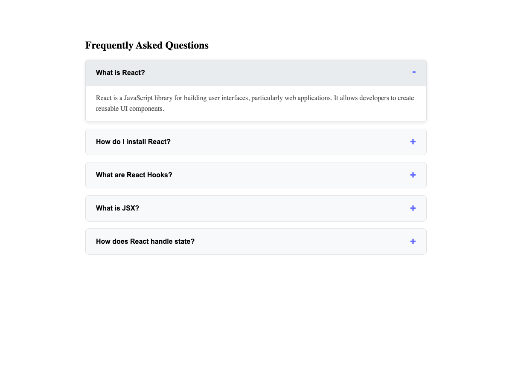

# React Practice Projects

This folder contains all my React practice projects and exercises.

## Projects

### 1. FAQ Component
A reusable Frequently Asked Questions (FAQ) component built with React, TypeScript, and Vite. Features accordion-style expand/collapse functionality with smooth animations.

**Technologies:** React, TypeScript, Vite, CSS

**Key Features:**
- Reusable FAQ component with TypeScript interfaces
- Accordion-style expand/collapse functionality
- Configurable options (title, allowMultipleOpen)
- Smooth animations and transitions
- Responsive design

**Repository:** Part of [react-practice](https://github.com/varunshah3129/react-practice)

**Location:** `./faq-component/`

**Project Output:**
The FAQ component displays a list of questions that can be expanded to reveal answers. When a question is clicked:
- The answer smoothly slides down with animation
- The icon changes from `+` to `−`
- Only one item can be open at a time (configurable)
- Each FAQ item has a clean, modern design with hover effects

**To Run:**
```bash
cd faq-component
npm install
npm run dev
```

**Screenshot:**


---

Add your React projects here. Each project should be in its own subfolder.

## Getting Started

To create a new React project, you can use:

```bash
npx create-react-app project-name
```

Or with Vite:

```bash
npm create vite@latest project-name -- --template react
```

## Notes

- Keep each project in its own folder
- Add a brief description of what each project demonstrates
- Document any key concepts or techniques learned
