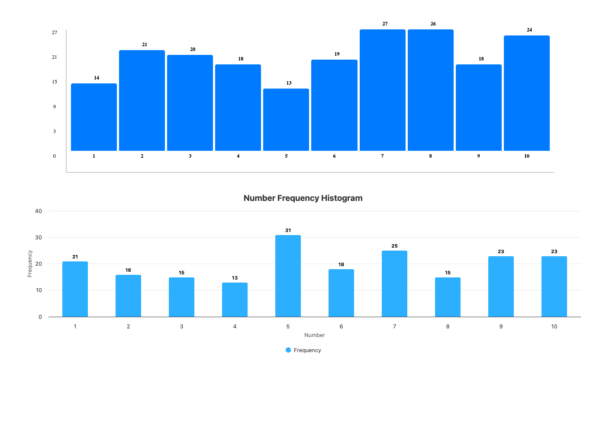

# Histogram Visualization

A histogram visualization tool that fetches numbers from an API and displays their frequency distribution. Features two implementations: CSS-based bars and Highcharts library version.

## 🚀 Technologies

- **React** - UI library
- **TypeScript** - Type safety
- **Vite** - Build tool and dev server
- **CSS** - Custom styling for CSS bars version
- **Highcharts** - Professional charting library (optional)

## ✨ Features

- ✅ Fetches 200 random numbers (1-10) from random.org API
- ✅ Calculates frequency of each number
- ✅ Two visualization implementations:
  - **CSS Bars Version**: Custom-built histogram with CSS
  - **Highcharts Version**: Professional chart using Highcharts library
- ✅ Properly numbered X and Y axes
- ✅ Data labels showing frequency counts
- ✅ Loading and error states
- ✅ Responsive design

## 📸 Screenshot



## 🛠️ Getting Started

### Prerequisites

- Node.js (v18 or higher)
- npm or yarn

### Installation

```bash
# Install dependencies
npm install
```

### Development

```bash
# Start development server
npm run dev
```

The app will be available at `http://localhost:5173` (or another port if 5173 is in use)

### Build

```bash
# Build for production
npm run build
```

## 📁 Project Structure

```
histogram-visualization/
├── src/
│   ├── components/
│   │   ├── Histogram.tsx              # CSS bars version
│   │   ├── Histogram.css              # CSS styling
│   │   ├── HistogramHighcharts.tsx    # Highcharts version
│   ├── App.tsx                        # Main app component
│   └── main.tsx                       # Entry point
├── screenshots/                       # Project screenshots
└── package.json
```

## 💻 Usage

The app automatically:
1. Fetches data from the random.org API on load
2. Parses the plain text response
3. Calculates frequency of each number (1-10)
4. Displays both CSS and Highcharts versions

**API Endpoint:**
```
https://www.random.org/integers/?num=200&min=1&max=10&col=1&base=10&format=plain&rnd=new
```

## 🎯 Key Concepts Demonstrated

- **API Integration**: Fetching data from external API
- **Data Processing**: Parsing text and calculating frequencies
- **Data Visualization**: Creating histograms with CSS and libraries
- **React Hooks**: `useState`, `useEffect` for state and side effects
- **TypeScript**: Type safety for data structures
- **CSS Layout**: Flexbox for chart layout and positioning
- **Chart Libraries**: Integration with Highcharts

## 📊 Two Implementation Approaches

### CSS Bars Version
- Built from scratch with CSS
- Demonstrates core visualization skills
- No external charting dependencies
- Full control over styling and behavior

### Highcharts Version
- Uses Highcharts library
- Professional chart appearance
- Built-in interactivity and tooltips
- Less code, more features out of the box

## 📝 License

This project is open source and available for practice purposes.
