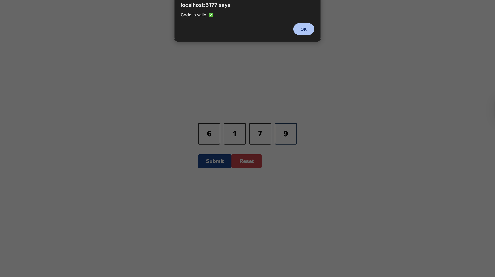
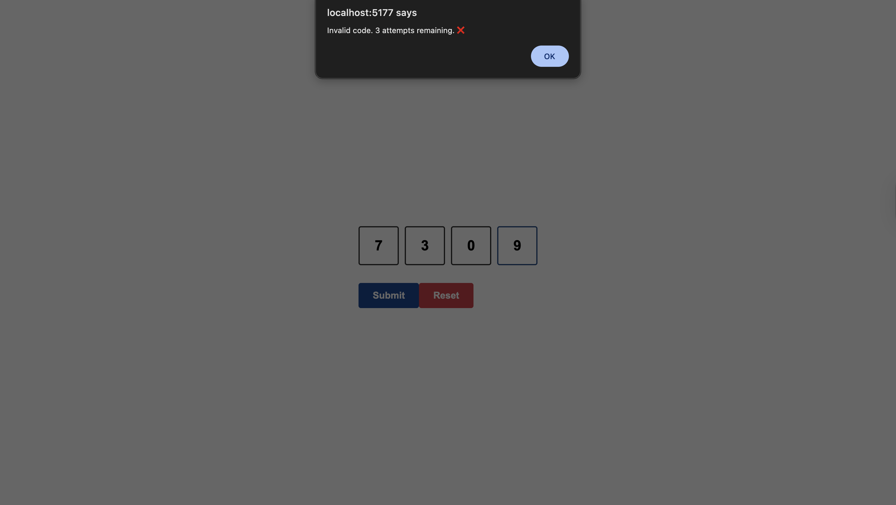

# Security Code Input

A 4-digit security code input component for two-factor authentication (2FA). Features auto-advance between fields, backspace navigation, max attempts limit, and form validation.

## 🚀 Technologies

- **React** - UI library
- **TypeScript** - Type safety
- **Vite** - Build tool and dev server
- **CSS** - Styling

## ✨ Features

- ✅ 4 separate input fields for each digit
- ✅ Only accepts digits 0-9 (rejects other input)
- ✅ Auto-advance to next field on input
- ✅ Backspace navigation to previous field
- ✅ Paste support for 4-digit codes
- ✅ Submit button disabled until all fields are filled
- ✅ Maximum 4 attempts limit
- ✅ Input fields disabled after max attempts
- ✅ Reset button to clear attempts and inputs
- ✅ Attempts counter display
- ✅ Form validation against hardcoded code

## 📸 Screenshots

**Valid Code:**


**Invalid Code (with attempts counter):**


## 🛠️ Getting Started

### Prerequisites

- Node.js (v18 or higher)
- npm or yarn

### Installation

```bash
# Install dependencies
npm install
```

### Development

```bash
# Start development server
npm run dev
```

The app will be available at `http://localhost:5173`

### Build

```bash
# Build for production
npm run build
```

## 📁 Project Structure

```
security-code-input/
├── src/
│   ├── components/
│   │   ├── SecurityCodeInput.tsx    # Main security code input component
│   │   └── SecurityCodeInput.css     # Component styling
│   ├── App.tsx                       # Main app component
│   └── main.tsx                      # Entry point
├── screenshots/                      # Project screenshots
└── package.json
```

## 💻 Usage

The component automatically handles:
- Input validation (only 0-9)
- Auto-focus and navigation
- Attempt tracking
- Form submission

**Default valid code:** `6179`

## 🎯 Key Concepts Demonstrated

- **React Hooks**: `useState` for state management, `useRef` for DOM references
- **TypeScript**: Type safety for inputs and state
- **Form Handling**: Controlled inputs and form submission
- **Event Handling**: Keyboard events (backspace), paste events
- **Input Validation**: Regex patterns for digit-only input
- **Accessibility**: ARIA labels and proper form structure
- **User Experience**: Auto-advance, disabled states, visual feedback

## 🔒 Security Features

- Maximum 4 attempts before lockout
- Input fields disabled after max attempts
- Reset functionality to start over
- Visual feedback for attempts remaining

## 📝 License

This project is open source and available for practice purposes.
